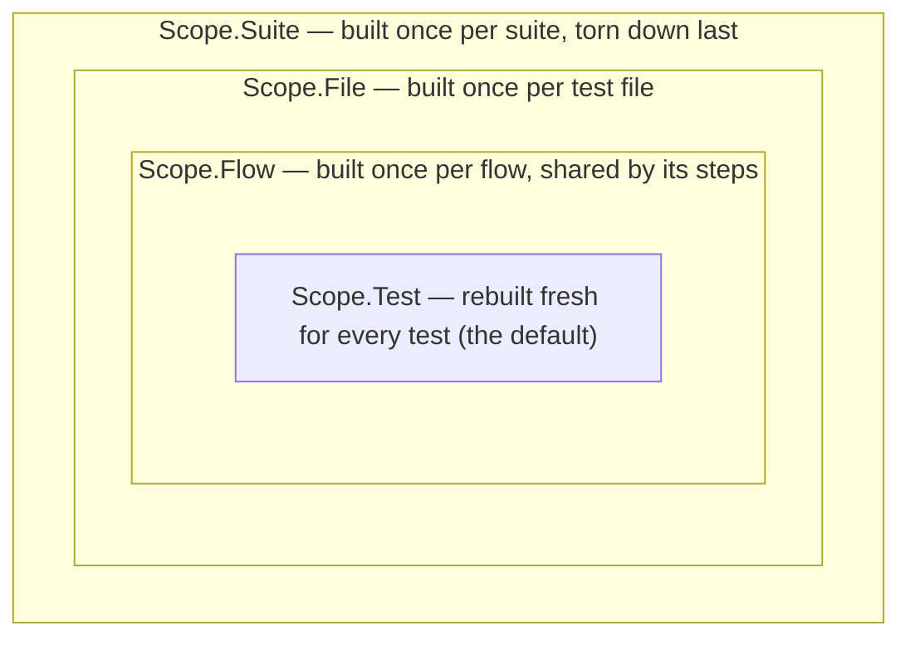

# Core Concepts

Prova has a small vocabulary: test files, tests, fixtures, groups, flows, suites, plugins, and a manifest. This page gives you each in one short section, with links to the deep dives.

## Test files

A test file is any Lua file named `*_test.lua` or `*.test.lua`. Point `prova` at a file or directory and it discovers them recursively. Inside a test file, `prova` and the module globals (`fs`, `shell`, `http`, and the rest) are **injected by the runtime — no `require` needed**. A test file is plain Lua 5.4: helper functions, loops, and computed values are all fair game.

## Tests

`prova.test(name, [opts,] body)` declares a test. The body receives a test context `t`, which carries assertions (`t:expect`), fixture access (`t:use`), and control flow (`t:skip`). Options cover `timeout`, `tags`, `requires`, `depends_on`, and `resources`:

```lua
prova.test("compiles cleanly", { timeout = "180s", requires = { "cargo" } }, function(t)
  local r = shell.run("cargo build", { cwd = t:use(project).path })
  t:expect(r.code):equals(0)
end)
```

Assertions are fluent matchers — `:equals`, `:contains`, `:matches`, `:exists`, `:never()` for negation, and more. Deep dives: [Tests and Grouping](../writing-tests/tests-and-grouping.md), [Assertions](../writing-tests/assertions.md).

## Fixtures and scopes

A fixture is a **named factory that produces a value**, declared with `prova.fixture(name, scope, factory)`. It is built lazily on first `use`, cached for its scope, and torn down when the scope ends — teardown registered with `ctx:defer` runs LIFO, guaranteed even on failure:

```lua
local workspace = prova.fixture("workspace", Scope.File, function(ctx)
  return ctx:tempdir()   -- auto-removed when the file's tests finish
end)

prova.test("uses the shared workspace", function(t)
  local dir = t:use(workspace)   -- built on first use, cached for the file
  ...
end)
```

The four scopes nest:



Fixtures can depend on other fixtures (`ctx:use` inside a factory), and dependencies always outlive their dependents. Deep dive: [Fixtures](../writing-tests/fixtures.md).

:::note Planned
Parametrized fixtures (`ctx:param()` + a `params` list, multiplying every dependent test across variants) are planned. Today, use `prova.test_each` for table-driven tests. See the [Roadmap](../reference/roadmap.md).
:::

## Groups vs. flows: independent vs. ordered

Execution strategy is declared by the **container**, never by a CLI flag:

- **`prova.group`** (and the file's top level, which is an implicit group) holds *independent* units: isolated, unordered, parallelizable. The group builder exposes no shared-state mechanism — cross-test coupling is not representable.
- **`prova.flow`** is an *ordered sequence*: steps run in declaration order on one worker, share the flow's state, and later steps are skipped once one fails.

You read the container and you know the semantics. The presence of a `flow` is always the visible signal that ordering and shared state are in play; the safe, independent strategy is the quiet default. Deep dives: [Flows](../writing-tests/flows.md), [Dependencies and Scheduling](../writing-tests/dependencies-and-scheduling.md).

## Suites

A **suite** is a named group of test files that share **one Lua state** — the unit of shared setup and of parallelism. Drop a `suite.lua` in a directory and its `*_test.lua` files become one suite; the `suite.lua` runs first and is where `Scope.Suite` fixtures live (one database container for every file, built once, torn down once). Test files consume suite fixtures by name: `t:use("pg")`. Any file not in a declared suite is its own singleton suite, so ungrouped files behave exactly as you'd expect. Deep dive: [Suites and Shared State](../writing-tests/suites-and-shared-state.md).

## Plugins

The core runtime ships the **primitives** — `shell`, `fs`, `net`, `docker`, `http`, `grpc`, and friends. Real infrastructure recipes (`postgres.container(ctx)`, `mysql.container(ctx)`, `pulsar.container(ctx)`, …) are **plugins**: Lua packages declared in the manifest's `[plugins]` table, fetched and pinned by ref, and attached in a test file with `require("postgres")`. A plugin resource comes back in a standard shape — `url`, `host`/`port`, a `client` for cross-checking, the `container` handle — so wiring a service to its database is a few plain assignments, and everything the plugin does can also be built by hand from the primitives when no plugin exists. Deep dive: [Plugins](/docs/plugins/).

## The manifest: `prova.toml`

A `prova.toml` (typically written by `prova init`) declares *what* to run and *how*, so plain `prova` with no arguments runs the configured suite — locally and in CI:

```toml
[run]
paths  = ["tests"]
jobs   = 4

[profiles.ci]
jobs   = 8
[profiles.ci.env]
CI = "true"

[plugins]
postgres = "prova-rs/prova-postgres@v0.2.0"
```

`prova --profile ci` overlays a profile on `[run]`; CLI flags override the manifest; explicit path arguments bypass it entirely. Deep dive: [Manifest and Profiles](../running-prova/manifest-and-profiles.md).

## Next

You have the vocabulary — now use it. Continue to the [Quick Start](./quick-start.md).
