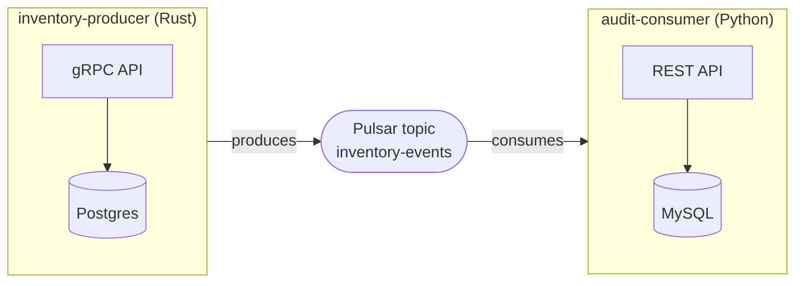

# Multi-Service Systems

[Testing Real Systems](./testing-real-systems.md) proved one service against one database. Real systems are rarely that polite: they are several services, in several languages, talking through a message broker, each with its own store. This page scales the pattern up without changing it. The vehicle ships in the Prova repository as `examples/kitchen-sink/` — the "kitchen sink": two services in two languages, three infrastructure dependencies, one end-to-end assertion chain.



A single test drives the whole topology: create an item over gRPC → assert the row landed in the producer's Postgres → watch the event cross Pulsar into the consumer → read the audit back over REST → cross-check the consumer's MySQL. Five hops, and an assertion at every tier boundary.

The polyglot mix is deliberate. The producer is Rust (tonic + sqlx), the consumer is Python (stdlib `http.server` + PyMySQL) — and not a single line of the test knows or cares. Prova tests systems from the *outside*: it speaks gRPC, HTTP, SQL, and Pulsar to whatever is listening. The implementation languages are irrelevant, which is exactly the point of black-box acceptance testing.

## Three dependencies, three plugins

All three infrastructure recipes are external [plugins](/docs/plugins/), declared in the example directory's `prova.toml`:

```toml
[run]
paths = ["."]

[plugins]
postgres = "prova-rs/prova-postgres@main"
mysql    = "prova-rs/prova-mysql@main"
pulsar   = "prova-rs/prova-pulsar@main"
```

The test file attaches them with ordinary `require`s and names the topic the two services meet on:

```lua
local postgres = require("postgres")
local mysql    = require("mysql")
local pulsar   = require("pulsar")

local TOPIC = "inventory-events"
```

## Three dependencies, three lines

```lua
-- Three real dependencies, one line each. The recipes gate on readiness that HOLDS (not just an
-- open socket) and tie every container and client to this fixture's teardown.
local infra = prova.fixture("infra", Scope.File, function(ctx)
  return {
    pg     = postgres.container(ctx, { user = "dev", password = "dev", database = "inventory" }),
    mysql  = mysql.container(ctx, { user = "dev", password = "dev", database = "audit" }),
    pulsar = pulsar.container(ctx),
  }
end)
```

One [fixture](./fixtures.md), three plugin recipes, and the entire provisioning story for the topology. Under the hood these three lines hide three *different* readiness semantics: `postgres.container` and `mysql.container` retry a real query until the connection *holds* (both databases restart during first-boot initialization, so an open socket is not yet a database), while `pulsar.container` gates on the broker's own `"messaging service is ready"` log line, because Pulsar standalone opens its ports long before it can serve. None of that leaks into this file — each plugin knows its technology's quirks so the fixture doesn't have to. Every container and every client is tied to the fixture's scope; teardown is automatic, pass or fail.

## Two services, one pattern each

Each service fixture follows the same boot-then-probe shape from [Testing Real Systems](./testing-real-systems.md): ask for `infra`, build, spawn on a dynamic port under `ctx:manage`, gate on the service's own protocol. First the Rust half — gRPC in front, Postgres behind, Pulsar out the back:

```lua
-- The Rust half: gRPC in front, Postgres behind, Pulsar out the back.
local producer = prova.fixture("producer", Scope.File, function(ctx)
  local env = ctx:use(infra)
  local dir = "../fixtures/inventory-producer"

  shell.run("cargo build", { cwd = dir, timeout = "600s", check = true })

  local port = net.free_port()
  ctx:manage(shell.spawn(dir .. "/target/debug/inventory-producer", {
    env = {
      DATABASE_URL = env.pg.url,
      PULSAR_URL   = env.pulsar.url,
      PULSAR_TOPIC = TOPIC,
      PORT         = port,
    },
  }))

  local addr = "127.0.0.1:" .. port
  -- The service connects to Postgres AND Pulsar before it serves, so a reflection answer proves
  -- the whole chain behind it.
  grpc.wait_for(addr, { timeout = "30s" })
  return { addr = addr }
end)
```

And the Python half — Pulsar in, MySQL behind, REST in front:

```lua
-- The Python half: Pulsar in, MySQL behind, REST in front.
local consumer = prova.fixture("consumer", Scope.File, function(ctx)
  local env = ctx:use(infra)
  local dir = "../fixtures/audit-consumer"

  local venv = ctx:tempdir()
  shell.run("python3 -m venv " .. venv .. " && " .. venv .. "/bin/pip install -q -r requirements.txt",
    { cwd = dir, timeout = "300s", check = true })

  local port = net.free_port()
  ctx:manage(shell.spawn(venv .. "/bin/python main.py", {
    cwd = dir,
    env = {
      DATABASE_URL = env.mysql.url,
      PULSAR_URL   = env.pulsar.url,
      PULSAR_TOPIC = TOPIC,
      PORT         = port,
    },
  }))

  local api = http.client{ base_url = "http://127.0.0.1:" .. port }
  -- HTTP up ⇒ the consumer's MySQL and Pulsar connections both succeeded.
  api:wait_for("/healthz", { timeout = "60s" })
  return { api = api }
end)
```

The shape is identical even though the languages aren't:

- **`ctx:use(infra)`** — a fixture-to-fixture dependency. Neither service knows how its dependencies came to exist; each just asks for them and wires the URLs into its own configuration surface (environment variables).
- **Build or install with [`shell.run`](../reference/modules/shell.md)** — `cargo build` for the Rust service, a throwaway venv (in a `ctx:tempdir()`) plus `pip install` for the Python one. A failure aborts with the toolchain's own stderr.
- **[`net.free_port()`](../reference/modules/shell.md#net) + `shell.spawn` under [`ctx:manage`](../reference/lua-api/context.md#ctxmanage)** — dynamic ports, guaranteed kill at teardown.
- **Gate on the service's own protocol, and let the gate do double duty.** Both services are fail-fast by design: they connect to every dependency at startup and exit non-zero on failure. So [`grpc.wait_for`](../reference/modules/grpc.md) answering proves the producer's Postgres *and* Pulsar connections succeeded, and the consumer's [`wait_for("/healthz")`](../reference/modules/http.md) proves the same for MySQL and Pulsar. One readiness probe, whole chain verified.

Notice the fixture DAG that has quietly assembled itself: both services depend on `infra`; tests depend on both services (and on `infra`, for cross-checking). Prova builds each fixture lazily, exactly once, and dependencies always outlive their dependents — so Postgres, MySQL, and Pulsar are provisioned a single time and torn down after both services are gone.

## The end-to-end test

```lua
  g:test("an item created over gRPC flows through every tier", function(t)
    local env  = t:use(infra)
    local prod = t:use(producer)
    local cons = t:use(consumer)

    -- 1. Create through the producer's public API — the only door a real client has.
    local client = grpc.client(prod.addr)
    local created = client:call("inventory.v1.Inventory/CreateItem", { display_name = "widget" })
    t:expect(created.id, "created id"):gt(0)
    t:expect(created.display_name):equals("widget")

    -- 2. The write landed in the producer's own Postgres.
    t:expect(env.pg.client:query_value(
      "SELECT count(*) FROM items WHERE display_name = $1", { "widget" })):equals(1)

    -- 3. The event crossed Pulsar into the consumer; its REST API shows the audit. Consumption is
    --    asynchronous, so poll — gate on state, never sleep.
    local audits = prova.retry(function()
      local res = cons.api:get("/audits")
      if res.status == 200 then
        local body = res:json()
        if body.audits and #body.audits >= 1 then return body.audits end
      end
    end, { timeout = "30s", message = "audit event never arrived through Pulsar" })
    t:expect(audits[1].item_id):equals(created.id)
    t:expect(audits[1].display_name):equals("widget")

    -- 4. Cross-check the consumer's MySQL — the event's final resting place.
    t:expect(env.mysql.client:query_value(
      "SELECT count(*) FROM audits WHERE item_id = ? AND display_name = ?",
      { created.id, "widget" })):equals(1)
  end)
```

Four steps, and an assertion at *every* tier boundary — not just at the end:

1. **Create through the public API.** [`grpc.client`](../reference/modules/grpc.md) builds a reflection-based client and calls `inventory.v1.Inventory/CreateItem` — the only door a real client has.
2. **Verify the first landing.** The plugin's managed `env.pg.client` points at the very Postgres the producer is wired to, so one `query_value` confirms the row exists before the event has gone anywhere.
3. **Poll across the asynchronous hop.** Everything so far was synchronous; Pulsar consumption is not. [`prova.retry`](../reference/lua-api/prova.md#provaretry) polls the consumer's REST API until the audit appears — gate on state, never `sleep`. If the event never arrives, the failure carries a message that says exactly which hop broke.
4. **Cross-check the final resting place.** The consumer's MySQL gets the same treatment as the producer's Postgres. The event has now been observed at every place it should exist.

The second test exercises the producer's read path — and demonstrates a discipline that matters as soon as a file has more than one test against shared infrastructure:

```lua
  g:test("the producer's list API reflects created items", function(t)
    local env  = t:use(infra)
    local prod = t:use(producer)

    local client = grpc.client(prod.addr)
    local created = client:call("inventory.v1.Inventory/CreateItem", { display_name = "sprocket" })

    -- Assert on OUR row, not on totals — the sibling test writes to the same shared Postgres, and
    -- independent tests must not depend on each other's side effects.
    local listed = client:call("inventory.v1.Inventory/ListItems", {})
    local found = false
    for _, item in ipairs(listed.items) do
      if item.id == created.id and item.display_name == "sprocket" then found = true end
    end
    t:expect(found, "created item present in ListItems"):is_true()
    t:expect(env.pg.client:query_value(
      "SELECT display_name FROM items WHERE id = $1", { created.id })):equals("sprocket")
  end)
```

Both tests share one Postgres, so neither may assert `count(*) == 1` on the whole table or `#listed.items == 1` — the sibling's rows are legitimately there. Each test asserts on its *own* rows, keyed by the id it created. That is what keeps independent tests independent when the fixtures underneath them are shared.

## The same topology, from primitives

Everything above leans on the plugins. The repository also ships `examples/kitchen_sink_primitives_test.lua` — the *same* topology with all three dependencies built by hand from `docker.run` (+ `wait` gates), `container:run` (driving the `psql`/`mysql` CLIs already in the images), `prova.retry`, and `ctx:manage`, deliberately showcasing three different readiness shapes (Postgres's query-that-holds, MySQL's longer first-boot horizon, Pulsar's log gate). From the service fixtures down, that file is essentially identical to this one, which is the punchline:

```lua
-- From here down the file is IDENTICAL to kitchen-sink/kitchen_sink_test.lua — the services neither
-- know nor care how their dependencies came to exist. That interchangeability is the point: a
-- hand-rolled provisioner that returns the standard { container, url } shape is indistinguishable
-- from a first-party plugin.
```

When one of *your* dependencies has no plugin, that is the escape hatch — and [Building from Primitives](./building-from-primitives.md) is the walkthrough.

## Run it

The example directory carries its own manifest (with the three `[plugins]`), so run it from there:

```shell
cd examples/kitchen-sink && prova
```

```text
  PASS  an item created over gRPC flows through every tier  (93.8s, 6 assert)
  PASS  the producer's list API reflects created items  (1.1s, 2 assert)

2 passed, 0 failed, 0 skipped   in 94.9s
```

The group declares `requires = { "docker", "cargo", "python3" }`, so on a machine missing any of the three, both tests skip with a reason instead of failing spuriously — see [Dependencies & Scheduling](./dependencies-and-scheduling.md). The first run compiles the Rust service and installs the Python dependencies, so give it time; Pulsar standalone dominates startup (roughly 60–90 seconds) and everything else rides in its shadow. The first test absorbs the fixture cost; the second reuses everything and finishes in about a second — and when several files need this stack, promote the fixtures into a [suite](./suites-and-shared-state.md) and pay the cost once for all of them.

:::note
The two services are deliberately plain, checked-in applications under `examples/fixtures/` — small enough to read in one sitting, with no scaffolding to see past. They may graduate into Archetect-org archetypes later; the test file would not change.
:::
